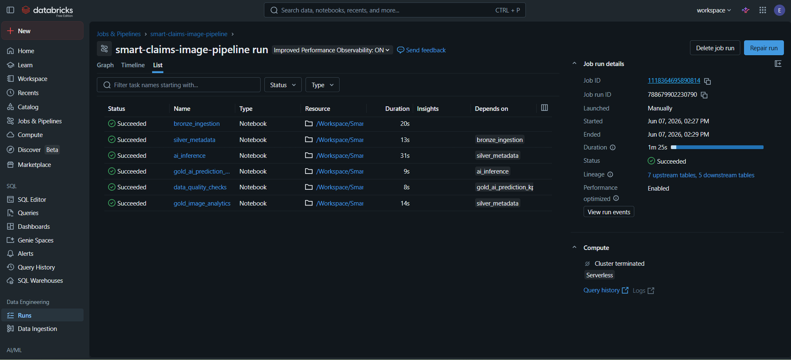
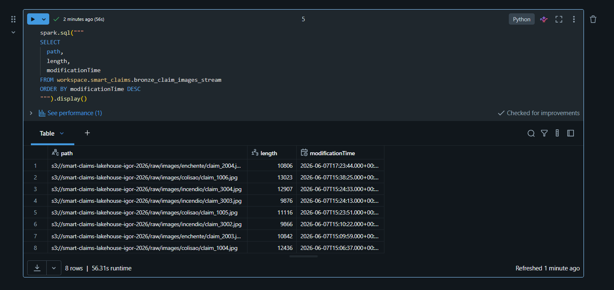
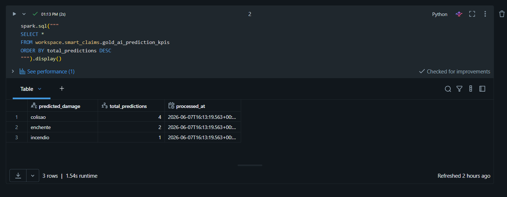
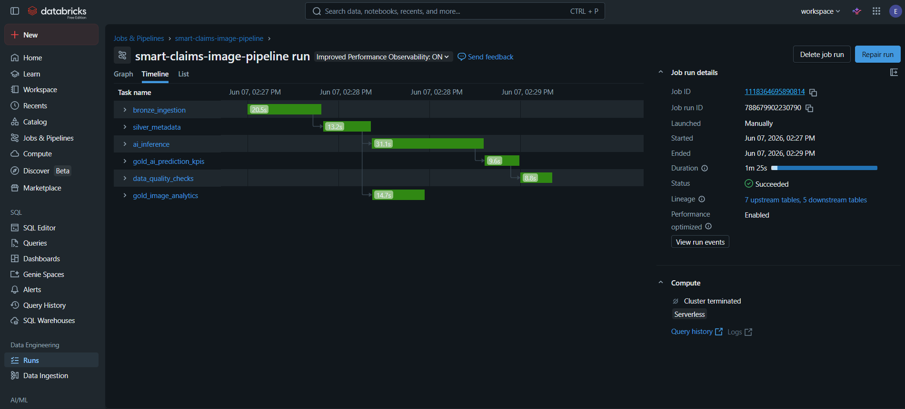

# Smart Claims Image Pipeline


End-to-end Lakehouse pipeline for insurance claim image processing using AWS S3, Databricks, Auto Loader, Delta Lake, Machine Learning and Databricks Workflows.

---

# Architecture



---

# Project Overview

This project simulates a real-world insurance claims processing pipeline.

Images uploaded to Amazon S3 are automatically ingested using Databricks Auto Loader, processed through a Medallion Architecture (Bronze, Silver and Gold layers), classified using Machine Learning, and transformed into business-ready KPIs.

The solution demonstrates modern Data Engineering and Data + AI practices commonly used in production environments.

---

## Bronze Layer - Auto Loader Stream

Automatic image ingestion from Amazon S3 using Databricks Auto Loader.



---

## AI Prediction KPIs

Predictions generated by the Machine Learning inference layer.



---

## Pipeline Lineage

End-to-end lineage of the pipeline execution.



---

# Medallion Architecture

```text
AWS S3
   │
   ▼
Bronze Layer
(Raw Images)
   │
   ▼
Silver Layer
(Image Metadata)
   │
   ▼
AI Inference Layer
(Classification)
   │
   ▼
Gold Layer
(Business KPIs)
```

---

# Technologies

- AWS S3
- Databricks
- PySpark
- Structured Streaming
- Auto Loader
- Delta Lake
- Databricks Workflows
- Machine Learning
- MLflow
- Data Quality Checks
- Lakehouse Architecture

---

# Pipeline Layers

## Bronze Layer

Raw image ingestion from Amazon S3.

Features:

- Incremental ingestion
- Auto Loader
- Structured Streaming
- Checkpoint management
- Delta storage

---

## Silver Layer

Metadata extraction from image paths.

Generated attributes:

| Column |
|----------|
| file_name |
| damage_type |
| length |
| ingestion_timestamp |

Example:

| file_name | damage_type |
|------------|------------|
| claim_1004.jpg | colisao |
| claim_2003.jpg | enchente |
| claim_3002.jpg | incendio |

---

## AI Inference Layer

Machine Learning model classifies images according to damage category.

Example predictions:

| file_name | predicted_damage |
|------------|------------------|
| claim_1004.jpg | colisao |
| claim_2003.jpg | enchente |
| claim_3002.jpg | incendio |

---

## Gold Layer

Business-oriented KPIs generated from model predictions.

Example:

| predicted_damage | total_predictions |
|------------------|------------------:|
| colisao | 4 |
| enchente | 2 |
| incendio | 1 |

---

# Workflow Orchestration

The entire pipeline is orchestrated using Databricks Workflows.

```text
bronze_ingestion
        │
        ▼
silver_metadata
        │
        ▼
ai_inference
        │
        ▼
gold_ai_prediction_kpis
        │
        ▼
data_quality_checks
```

---

# Data Quality

The project includes automated validation checks.

Examples:

- Bronze vs Silver record count validation
- Missing metadata detection
- Pipeline consistency checks
- Data completeness validation

---

# Business Value

Insurance companies process thousands of claim images every day.

This solution demonstrates how to:

- Automate image ingestion
- Classify damages using Machine Learning
- Generate business KPIs
- Ensure data quality
- Orchestrate data pipelines
- Scale processing using Lakehouse Architecture

Benefits:

- Reduced manual effort
- Faster claim processing
- Better operational visibility
- Real-time analytics
- Automated AI classification

---

# Analytics Queries

Sample SQL queries are available in:

```text
sql/analytics_queries.sql
```

Examples:

- Total predictions by damage type
- Processing volume over time
- Data Quality validations
- Pipeline operational metrics

---

# Repository Structure

```text
smart-claims-image-pipeline/
│
├── README.md
├── LICENSE
├── .gitignore
│
├── notebooks/
│   ├── 01_bronze/
│   ├── 02_silver/
│   ├── 03_ai/
│   ├── 04_gold/
│   └── 05_data_quality/
│
├── docs/
│   ├── bronze_stream.png
│   ├── workflow.png
│   ├── gold_ai_kpis.png
│   └── lineage.png
│
└── sql/
    └── analytics_queries.sql
```

---

# Interview Highlights

This project demonstrates practical experience with:

✔ AWS S3

✔ Databricks

✔ PySpark

✔ Delta Lake

✔ Structured Streaming

✔ Auto Loader

✔ Incremental Processing

✔ Lakehouse Architecture

✔ Medallion Architecture

✔ Data Quality

✔ Machine Learning Integration

✔ Workflow Orchestration

✔ End-to-End Data Pipelines

---

# Future Improvements

- Deep Learning image classification
- MLflow Model Registry
- Real-time dashboarding
- CI/CD pipeline integration
- Terraform infrastructure deployment
- Delta Live Tables implementation

---

# Author

### Igor Elipechuk

Data Engineering | AWS | Databricks | PySpark | Delta Lake | Machine Learning

GitHub:
https://github.com/ElipechukIgor

LinkedIn:
(Add your LinkedIn URL)

---

